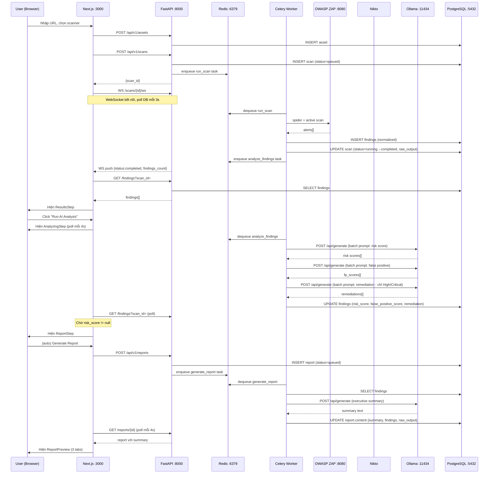

# ATTT — Kiến trúc hệ thống thực tế

> Tài liệu này mô tả đúng code đang chạy, không phải kế hoạch tương lai.

---

## Tổng quan kiến trúc

```
┌─────────────────────────────────────────────────────────────────────────────┐
│                              USER BROWSER                                   │
│                                                                             │
│   Login → Launch Scan → Scanning (live) → Results → AI Analysis → Report   │
└──────────────────────────────────┬──────────────────────────────────────────┘
                                   │  HTTP REST + WebSocket
                                   ▼
┌─────────────────────────────────────────────────────────────────────────────┐
│                         NEXT.JS FRONTEND  :3000                             │
│                                                                             │
│  page.tsx (state machine)         report-preview.tsx                        │
│  ├─ LoginStep                     ├─ Tab: Summary (severity counts, top 3)  │
│  ├─ ScanStep (recent scans)       ├─ Tab: Findings & Fix (AI remediation)   │
│  ├─ ScanningStep (WS live feed)   └─ Tab: Raw Output (ZAP alerts table)     │
│  ├─ ResultsStep (findings table)                                            │
│  ├─ AnalyzingStep (AI polling)    lib/api.ts                                │
│  └─ ReportStep (preview + export) └─ apiGet / apiPost / scanWsUrl()         │
└──────────────────────────────────┬──────────────────────────────────────────┘
                                   │  HTTP REST + WebSocket
                                   ▼
┌─────────────────────────────────────────────────────────────────────────────┐
│                         FASTAPI BACKEND  :8000                              │
│                                                                             │
│  Routers                          Middleware                                │
│  ├─ /auth       (JWT login/me)    ├─ require_roles() — RBAC                 │
│  ├─ /assets     (target URLs)     └─ get_db()     — SQLAlchemy session      │
│  ├─ /scans      (CRUD + WS)                                                 │
│  │   └─ WS /{scan_id}/ws          DB Models                                 │
│  ├─ /findings   (filter by scan)  ├─ Asset, Scan, Finding, Report           │
│  └─ /reports    (filter by scan)  └─ JSONB: evidence, remediation,          │
│                                              raw_output, content            │
└──────┬───────────────────────────────────────────────────┬──────────────────┘
       │ enqueue task (Celery)                             │ read/write
       ▼                                                   ▼
┌────────────────┐     ┌──────────────────────────────────────────────────────┐
│  REDIS  :6379  │     │                POSTGRESQL  :5432                     │
│                │     │                                                      │
│  Task broker   │     │  assets     scans          findings      reports     │
│  Task results  │     │  ─────────  ──────────────  ──────────────  ──────── │
└────────┬───────┘     │  id         id              id             id        │
         │             │  url        asset_id         scan_id        scan_id   │
         ▼             │             scanner          type           type      │
┌────────────────────────────────┐   status           severity       content   │
│      CELERY WORKER             │   config           title          (JSONB)   │
│                                │   started_at       description              │
│  scan_tasks.py                 │   finished_at      evidence(JSONB)          │
│  ├─ run_scan()                 │   raw_output       remediation              │
│  │   ├─ zap.run()       ───────┤   (JSONB)          (JSONB)                  │
│  │   ├─ nikto.run()     ───────┤                    risk_score               │
│  │   ├─ normalize()           │                    false_positive_score     │
│  │   └─ save findings → DB ───┤                                             │
│  │                            └─────────────────────────────────────────────┘
│  ai_tasks.py                   
│  ├─ analyze_findings()         
│  │   ├─ risk_prioritizer    ──┐
│  │   ├─ false_positive      ──┼──► OLLAMA :11434
│  │   └─ remediation         ──┘    llama3 (batch prompt)
│  │                            
│  report_tasks.py               
│  └─ generate_report()         
│      ├─ executive_summary  ──► OLLAMA :11434
│      └─ save report → DB      
└────────────────────────────────
```

---

## Luồng dữ liệu chính



---

## Mô tả từng module

### 1. Frontend — Next.js (`:3000`)

| File | Chức năng |
|------|-----------|
| `app/page.tsx` | State machine 6 bước: Login → Scan → Scanning → Results → Analyzing → Report |
| `components/reports/report-preview.tsx` | Hiển thị report với 3 tab: Summary / Findings & Fix / Raw Output |
| `lib/api.ts` | `apiGet`, `apiPost`, `apiPostForm`, `scanWsUrl()` — quản lý JWT token |

**State machine:**
```
login ──► scan ──► scanning ──► results ──► analyzing ──► report
           ▲          │ (fail)      │                        │
           └──────────┘             └────────────────────────┘
                                         (click Recent Scan)
```

---

### 2. Backend API — FastAPI (`:8000`)

```
app/
├── api/v1/routers/
│   ├── auth.py      POST /token, GET /me  — JWT (HS256)
│   ├── assets.py    POST, GET             — quản lý target URL
│   ├── scans.py     CRUD + WS             — khởi tạo scan, WebSocket feed
│   ├── findings.py  GET ?scan_id=         — kết quả scan
│   └── reports.py   POST, GET ?scan_id=   — tạo và xem report
├── core/
│   ├── security.py  require_roles()       — RBAC: viewer/analyst/admin
│   └── config.py    Settings (env vars)
└── db/
    ├── models/      SQLAlchemy ORM + JSONB columns
    └── session.py   init_db() + auto-migrations
```

**RBAC:**
- `viewer` — chỉ đọc findings, reports
- `analyst` — tạo scan, tạo report
- `admin` — toàn quyền

---

### 3. Task Queue — Celery + Redis (`:6379`)

```
app/tasks/
├── scan_tasks.py      run_scan(scan_id, target, scanner, config)
│   ├── gọi zap.run() hoặc nikto.run()
│   ├── normalize kết quả → INSERT findings
│   ├── UPDATE scan.raw_output (JSON gốc từ scanner)
│   └── enqueue analyze_findings
│
├── ai_tasks.py        analyze_findings(scan_id)
│   ├── risk_prioritizer  — batch 1 LLM call cho High/Critical
│   ├── false_positive    — batch 1 LLM call
│   ├── remediation       — batch 1 LLM call (chỉ High/Critical; còn lại dùng template)
│   └── UPDATE findings.risk_score / .false_positive_score / .remediation
│
└── report_tasks.py    generate_report(report_id, scan_id, type)
    ├── load findings từ DB
    ├── executive_summary — 1 LLM call (max 20 findings, compact prompt)
    └── UPDATE report.content {summary, findings, raw_output}
```

**Tối ưu AI:** Thay vì N×3 LLM calls (1 call/finding × 3 services), hệ thống gộp thành **3 batch calls** tổng cộng cho toàn bộ scan.

---

### 4. Security Scanners

#### OWASP ZAP (`:8080`) — Web Application Scanner
```
app/services/scanners/zap.py

Luồng scan:
  1. new_session()
  2. _ensure_context()    — tạo ZAP context, cấu hình auth (form/basic/jwt_header)
  3. spider.scan()        — Traditional Spider (HTML crawl nhanh)
  4. ajaxSpider.scan()    — AJAX Spider (crawl Angular/React SPA) [nếu bật]
  5. ascan.scan()         — Active Scan (test các lỗ hổng)
  6. core.alerts()        — lấy danh sách findings

Auth modes:
  - form        — POST login form, ZAP giữ session cookie
  - basic       — HTTP Basic Auth
  - jwt_header  — httpx POST lấy token → ZAP Replacer inject Authorization header
```

#### Nikto — Server Scanner
```
app/services/scanners/nikto.py

Chạy nikto CLI → parse JSON output
Kiểm tra: server version, misconfig, default files, CVE known issues
```

---

### 5. AI Intelligence — Ollama (`:11434`)

```
app/services/ai/
├── risk_prioritizer.py    Xếp hạng rủi ro 0.0–1.0
│   ├── High/Critical → gửi batch prompt cho llama3
│   └── Medium/Low/Info   → dùng severity base score (không tốn LLM)
│
├── false_positive.py      Phát hiện cảnh báo sai
│   └── 1 LLM call, phân tích hết findings, trả về fp_score 0.0–1.0
│       (≥ 0.7 = Likely False Positive)
│
├── remediation.py         Gợi ý cách vá lỗi
│   ├── High/Critical → LLM sinh {summary, steps[], references[]}
│   └── Medium/Low    → template cố định (không tốn LLM)
│
└── executive_summary.py   Tóm tắt báo cáo điều hành
    └── Compact prompt: chỉ title/severity/CWE/risk_score, tối đa 20 findings
```

**Model đang dùng:** `llama3` (cấu hình trong `OLLAMA_MODEL` env var)

---

### 6. Storage — PostgreSQL + pgvector (`:5432`)

```sql
assets    — target URLs (id, url, created_at)
scans     — lịch sử scan
          + raw_output JSONB  ← raw ZAP/Nikto output
findings  — kết quả từng lỗ hổng
          + evidence    JSONB  ← url, param, method, confidence
          + remediation JSONB  ← AI-generated {summary, steps, references}
reports   — báo cáo tổng hợp
          + content     JSONB  ← {summary, findings[], raw_output}
users     — tài khoản (admin/analyst/viewer)
```

**pgvector** — đã cài đặt, dùng cho embeddings tương lai (RAG chưa implement).

---

### 7. Infrastructure — Docker Compose

```yaml
Services:
  db        postgres:15 + pgvector          :5432
  redis     redis:7                         :6379
  ollama    ollama/ollama (llama3)          :11434
  zap       zaproxy/zaproxy:stable          :8080
  api       FastAPI + uvicorn --reload      :8000
  worker    Celery worker                   (no port)
  web       Next.js npm run dev             :3000
  prometheus prom/prometheus                :9090
```

**ZAP config quan trọng:**
```yaml
# Cho phép API từ mọi IP trong Docker network
-config api.disablekey=true
-config api.addrs.addr.name=.*
-config api.addrs.addr.regex=true
```

---

## Flow nhanh: từ click đến report

```
[User click Start Scan]
        │
        ▼
POST /assets → POST /scans → enqueue run_scan
        │
        ▼ (async, Worker)
ZAP spider → ZAP active scan → collect alerts
        │
        ▼
normalize findings → INSERT DB → UPDATE scan.raw_output
        │
        ▼ (enqueue)
AI batch: risk score → false positive → remediation
        │
        ▼
UPDATE findings (risk_score, fp_score, remediation)
        │
        ▼ (user click "Run AI Analysis" xong rồi auto navigate)
POST /reports → enqueue generate_report
        │
        ▼ (async, Worker)
executive_summary (1 LLM call) → UPDATE report.content
        │
        ▼
ReportPreview: Summary | Findings & Fix | Raw Output
```

---

## Ghi chú triển khai

```bash
# Khởi động toàn bộ hệ thống
docker compose up --build

# Endpoints
Web UI:    http://localhost:3000
API:       http://localhost:8000
API docs:  http://localhost:8000/docs
Metrics:   http://localhost:9090

# Demo accounts
admin   / admin123
analyst / analyst123
viewer  / viewer123
```
